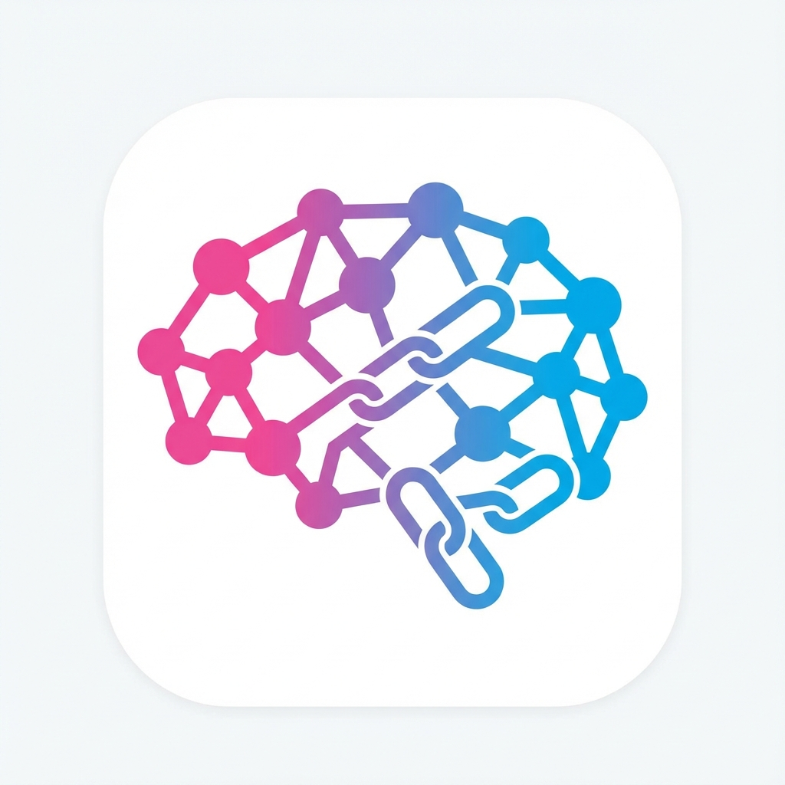

<div align="center">

</div>

# ChainLearn AI - 智能学习平台

🇺🇸 [English Documentation](README.md)

一个基于 AI 的交互式学习平台，通过节点式对话系统和可视化工具，帮助用户高效掌握知识。

View your app in AI Studio: https://ai.studio/apps/drive/1Q3SKXH21XXO0Dp9thuukmGxSfMO1Qyia

## ✨ 核心功能

### 🎯 节点式学习链
- AI 自动将学习主题分解为多个逻辑节点
- 每个节点包含结构化的学习目标（Micro-steps）
- 上下文累积：前一节点的知识自动传递到下一节点

### 📊 可视化知识图谱
- **自动生成 Mermaid 图表**：AI 在讲解复杂概念时自动输出可视化图表
- **支持多种图表类型**：
  - 流程图 (Flowchart) - 展示流程、算法
  - 时序图 (Sequence Diagram) - 展示交互过程
  - 类图 (Class Diagram) - 展示对象关系
  - 思维导图 (Mindmap) - 展示概念层次
- **暗黑主题适配**：图表颜色完美适配应用主题
- **全屏查看**：支持大图全屏浏览

### 🎓 智能实战测验
- **自动生成测验**：基于对话内容生成 3-5 道选择题
- **即时反馈**：选择答案后立即显示对错和详细解析
- **游戏化体验**：
  - 实时得分显示
  - 完美掌握动效
  - 鼓励性反馈
- **可重复测试**：巩固知识，直到完全掌握

### 📚 学习管理
- **学习历史**：记录所有学习会话
- **学习日历**：可视化学习进度和热力图
- **继续学习**：随时恢复之前的学习状态

### 🤖 多 AI 提供商支持
- Google Gemini (默认)
- OpenAI 兼容 API
- 自定义 API 端点

## 🚀 快速开始

**前置要求:** Node.js

1. 安装依赖:
   ```bash
   npm install
   ```

2. 配置 API Key:
   - 在 [.env.local](.env.local) 中设置 `GEMINI_API_KEY`
   - 或在应用设置中配置自定义 AI 提供商

3. 启动应用:
   ```bash
   npm run dev
   ```

4. 构建生产版本:
   ```bash
   npm run build
   ```

## 📖 使用指南

### 开始学习
1. 在首页输入你想学习的主题（例如："React Hooks"、"量子物理"）
2. AI 会自动生成学习路径，分解为多个节点
3. 逐个节点进行交互式学习

### 触发可视化图表
询问需要可视化的问题，例如：
- "解释 TCP 三次握手流程"
- "React 渲染机制是什么"
- "快速排序算法的步骤"

AI 会自动生成相应的图表帮助理解。

### 使用测验功能
1. 在学习节点中与 AI 对话（至少 2 轮）
2. 点击"知识自测"按钮
3. 完成测验并查看得分
4. 根据反馈决定是否继续学习或进入下一节点

## 📁 项目结构

```
chainlearn-ai/
├── components/          # React 组件
│   ├── Calendar.tsx     # 学习日历
│   ├── LearningHistory.tsx  # 学习历史
│   ├── MermaidBlock.tsx     # Mermaid 图表渲染
│   ├── QuizModal.tsx        # 测验界面
│   ├── SimpleMarkdown.tsx   # Markdown 渲染
│   └── ...
├── services/           # 业务逻辑
│   ├── geminiService.ts     # AI 服务
│   ├── learningStats.ts     # 学习统计
│   └── expertService.ts     # 专家路由
├── docs/              # 文档
│   ├── new-features.md      # 新功能说明
│   ├── testing-guide.md     # 测试指南
│   └── ...
├── App.tsx            # 主应用
├── types.ts           # TypeScript 类型定义
└── ...
```

## 🎨 技术栈

- **前端框架**: React 19 + TypeScript
- **构建工具**: Vite
- **AI 服务**: Google Gemini API / OpenAI Compatible API
- **可视化**: Mermaid.js
- **图标**: Lucide React
- **样式**: Tailwind CSS

## 📚 文档

- [新功能说明](docs/new-features.md) - 详细的功能介绍
- [测试指南](docs/testing-guide.md) - 如何测试新功能
- [更新日志](CHANGELOG.md) - 版本更新记录
- [系统架构](docs/systemArchitecture.md) - 技术架构说明

## 🤝 贡献

欢迎提交 Issue 和 Pull Request！

## 📄 许可证

MIT License
